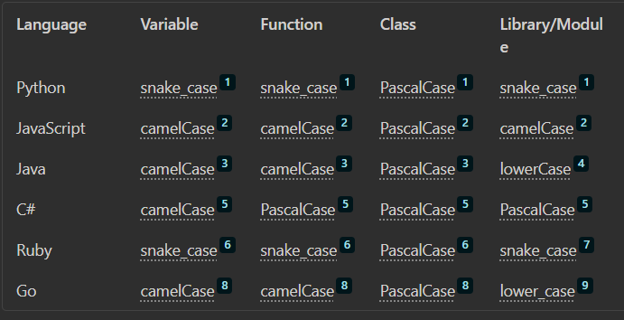

.NET 
Framework-Dependent Deployment (FDD): In this case, the .NET Core runtime must be installed on the target system. The advantage of this approach is that the application binaries are smaller.

Self-Contained Deployment (SCD): In this case, the .NET Core runtime is bundled with the application. This results in larger application binaries, but the application can run on any system that it’s deployed to, without requiring the .NET Core runtime to be installed separately.

This means that the resulting executable program does not depend on a C run-time library1.However, even if a C or C++ program does not use OS-specific libraries, it will often have to be linked with a platform-specific run-time library1. So, for example, a “Hello, world!” app built for Windows can’t be run on Linux, or vice versa, even if the hardware architecture is the same1. This is because the runtime libraries often provide interfaces to the operating system, and these interfaces can vary between different operating systems

